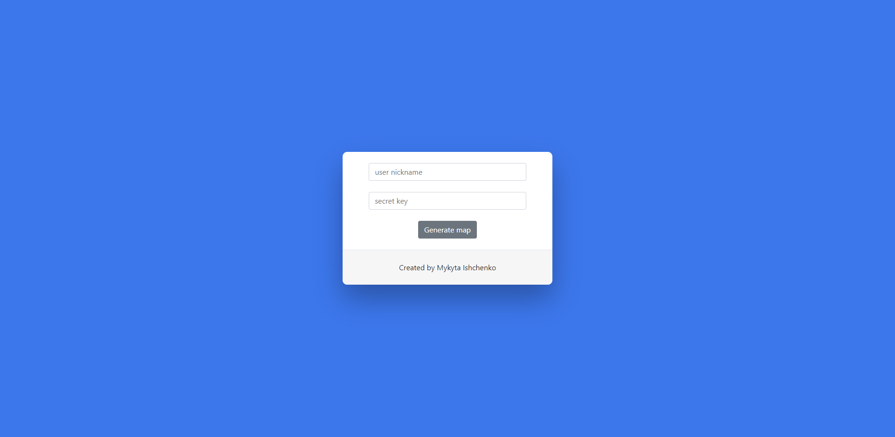
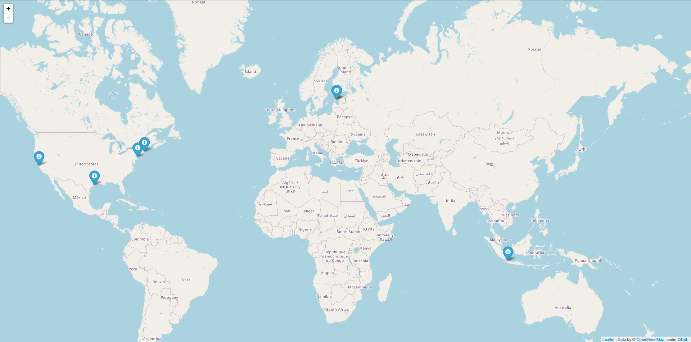

## Twitter map generator
**A python module that allows the user to generate map of user twitter followers.**

#### Start
1) All needed libraries for the projects you can find in requirements.txt
2) Open app.py
3) Run app.py
4) Open web page

#### Using
1) Fill out the entry form: twitter user nickname and brier token. *(You can not user map generator without twitter API keys.)*
2) Submit map generate button.

#### Online
Online version you can find at: http://nikitaishchenko.pythonanywhere.com

#### Screenshots

